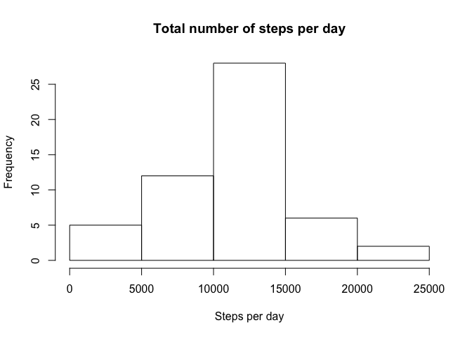
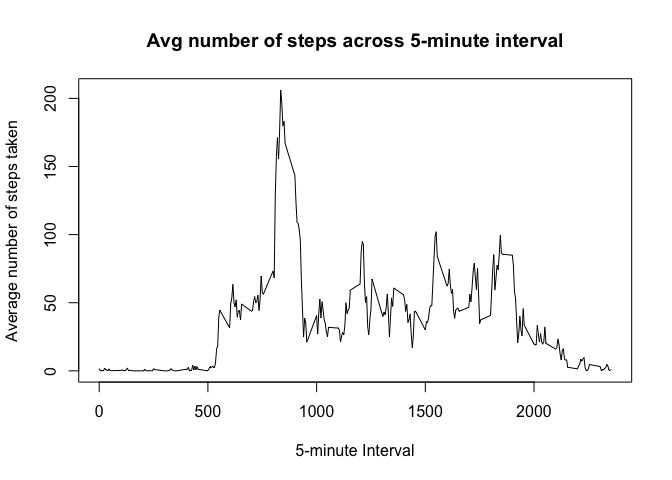
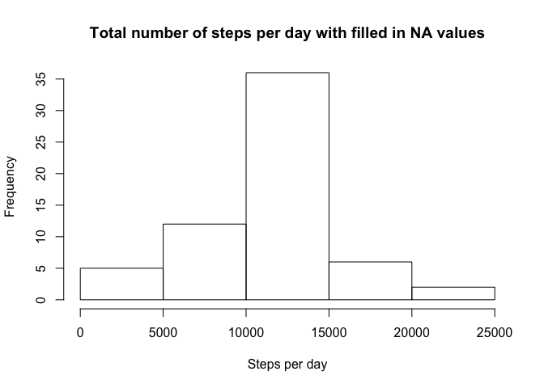
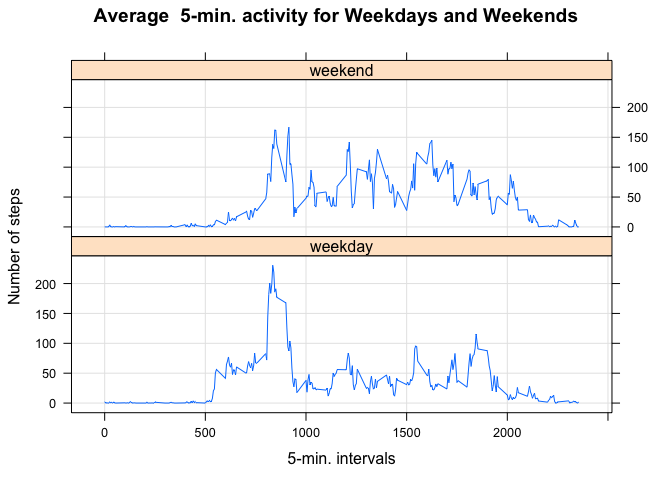

# Reproducible Research project1
Don Resnik  
May 12, 2016  


##Loading and preprocessing the data
##What is mean total number of steps taken per day?

```r
library(dplyr)
```

```
## 
## Attaching package: 'dplyr'
```

```
## The following objects are masked from 'package:stats':
## 
##     filter, lag
```

```
## The following objects are masked from 'package:base':
## 
##     intersect, setdiff, setequal, union
```

```r
dataValue <- read.csv("activity.csv")
dataValueNoNA <- filter(dataValue,!is.na(dataValue$steps))
#generate histogram of steps per day
stepsPerDay <- aggregate(steps ~ date, dataValueNoNA, sum)
hist(stepsPerDay$steps, main = "Total number of steps per day", xlab = "Steps per day")
```

<!-- -->

```r
# calculate mean and median values
stepsPerDayMean <- mean(stepsPerDay$steps)
stepsPerDayMedian <- median(stepsPerDay$steps)
```

###Steps per day Mean:  10766
###Steps per day Median:  10765

##What is the average daily activity pattern?

```r
averageStepsByInterval <- tapply(dataValueNoNA$steps, dataValueNoNA$interval, FUN=mean)
averageStepsByIntervaldf <- data.frame(averageStepsByInterval)
plot(names(averageStepsByInterval), averageStepsByInterval, type = "l", xlab = "5-minute Interval", 
    ylab = "Average number of steps taken", main = "Avg number of steps across 5-minute interval")
```

<!-- -->

```r
# Find the index and the maximum value
maxValueAndInterval <- averageStepsByIntervaldf[which.max(averageStepsByIntervaldf$averageStepsByInterval),]
maxValue <- maxValueAndInterval[[1]]
maxInterval <- names(maxValueAndInterval)
```
###maxInterval 835
###maxValue 206.1698113

##Imputing missing values

```r
# Find NA Values
NAvalues <- filter(dataValue,is.na(dataValue$steps))
numNARows <- nrow(NAvalues)
head(NAvalues)
```

```
##   steps       date interval
## 1    NA 2012-10-01        0
## 2    NA 2012-10-01        5
## 3    NA 2012-10-01       10
## 4    NA 2012-10-01       15
## 5    NA 2012-10-01       20
## 6    NA 2012-10-01       25
```

### Number of rows wih NA 2304

##Fill in all of the missing values in the dataset with the mean for that 5-minute interval.

```r
for (i in 1:nrow(NAvalues)) {
    NAvalues[i, 1] <- averageStepsByInterval[[toString(NAvalues[i, 3])]]
}
head(NAvalues)
```

```
##       steps       date interval
## 1 1.7169811 2012-10-01        0
## 2 0.3396226 2012-10-01        5
## 3 0.1320755 2012-10-01       10
## 4 0.1509434 2012-10-01       15
## 5 0.0754717 2012-10-01       20
## 6 2.0943396 2012-10-01       25
```

```r
filledInData <- dataValue
filledInData[is.na(dataValue), 1] <- NAvalues[, 1]
stepsPerDayWithFilledNA <- aggregate(steps ~ date, filledInData, sum)
hist(stepsPerDayWithFilledNA$steps, main = "Total number of steps per day with filled in NA values", xlab = "Steps per day")
```

<!-- -->

```r
# calculate mean and median values
stepsPerDayMeanWithFilledNA <- trunc(mean(stepsPerDayWithFilledNA$steps), digits=0)
stepsPerDayMedianWithFilledNA <- trunc(median(stepsPerDayWithFilledNA$steps), digits=0)
```

###Steps per day with filled in NA Mean:  10766
###Steps per day with filled in NA Median:  10766

### For this case, filling in the NA values did not make much difference in the mean or median number of steps per day.


##Are there differences in activity patterns between weekdays and weekends?

```r
filledInData$day <- "weekday"
filledInData$day[weekdays(as.Date(filledInData$date), abb=T) %in% c("Sat","Sun")] <- "weekend"
```


```r
library(lattice)
meanStepsPerIntervalWithFilledInData <- aggregate(steps ~ interval + day, data=filledInData, FUN="mean")
xyplot(steps ~ interval | day, data=meanStepsPerIntervalWithFilledInData, type="l", grid=T, layout=c(1,2), ylab="Number of steps", xlab="5-min. intervals", main="Average  5-min. activity for Weekdays and Weekends")
```

<!-- -->
